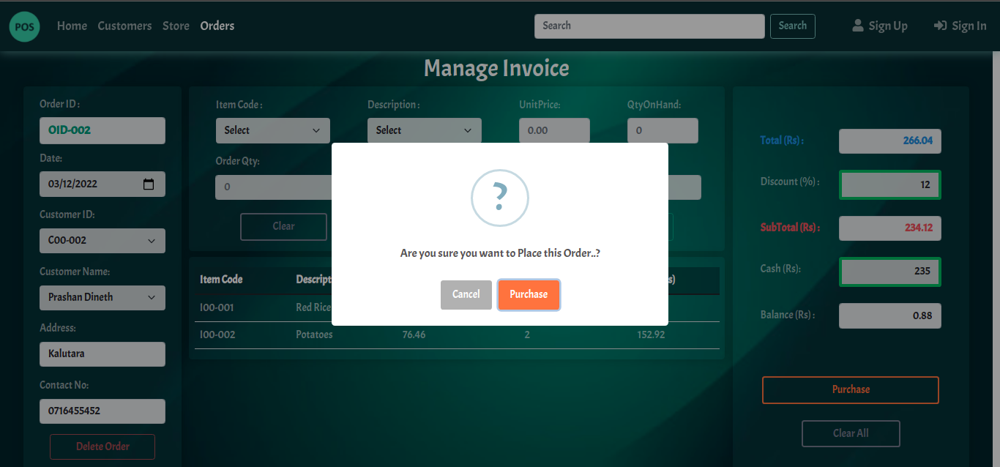

# Enterprise Level Application with Spring Web MVC

## POS system 
- Back-end & Front-end on seperate origins
- handled cross-origin requests (CORS issue)
- configured JNDI Resource for a Tomcat Connection Pool
- applied Layered Architecture 

## Used :

- Spring
- Apache Tomcat Web Container
- AJAX
- MySQL
- HTML
- CSS
- JavaScript
- JQuery
- Bootstrap
- SweetAlerts
- Toastr

 

   
   
   
   

